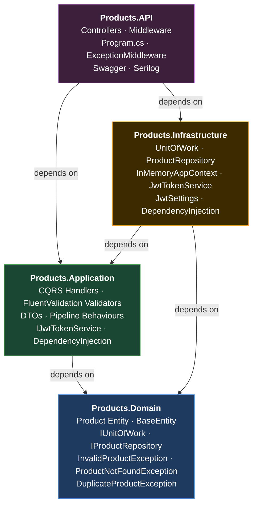
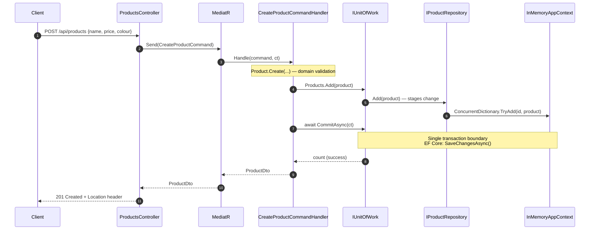
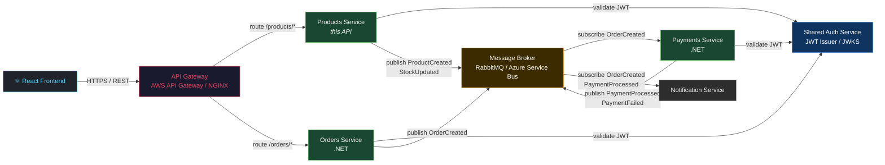

# Architecture

## 1. Clean Architecture Layers

Each layer depends only inward. The Domain has zero dependencies on any other layer or external package.

**Dependency rule (strictly enforced):**

| Layer | May reference |
|---|---|
| Domain | Nothing (pure C#) |
| Application | Domain only |
| Infrastructure | Domain + Application |
| API | Application + Infrastructure |

The Domain and Application layers are **framework-free**. Swapping InMemoryAppContext for Entity Framework Core, or replacing RabbitMQ with Azure Service Bus, requires changes only in Infrastructure.

---

## 2. Unit of Work Pattern — CreateProduct Request Flow

### Why Unit of Work?

The Unit of Work enforces a **single atomic transaction boundary** per HTTP request.

- `IProductRepository.Add/Update/Remove` are **synchronous void** — they stage changes but never persist.
- `IUnitOfWork.CommitAsync()` is the **only** method that writes to the store. This mirrors `DbContext.SaveChangesAsync()` exactly.
- If `CommitAsync` fails (e.g. a constraint violation), `RollbackAsync()` is called — no partial state is ever committed.
- Because `UnitOfWork` is registered as **Scoped**, every HTTP request gets its own unit of work instance, preventing cross-request contamination.
- When InMemoryAppContext is swapped for EF Core's `DbContext`, only `CommitAsync` and `RollbackAsync` change — every handler, test, and interface stays identical.

---

## 3. Microservices Event-Driven Architecture

### Why CQRS?

**Command Query Responsibility Segregation** separates the write model (Commands) from the read model (Queries).

- **Write side** (`CreateProductCommand`) goes through FluentValidation, domain creation, and UoW commit — the full pipeline.
- **Read side** (`GetAllProductsQuery`, `GetProductsByColourQuery`) bypasses all mutation logic and returns DTOs directly, with minimal overhead.
- As the system grows, read and write models can be scaled independently. The read side can be served from a read replica, a cache, or a dedicated read-optimised store (e.g. Elasticsearch) without touching write handlers.
- MediatR's `IPipelineBehavior<,>` allows cross-cutting concerns (logging, validation) to be applied selectively — for example, `ValidationBehaviour` only fires when a registered `IValidator<TRequest>` exists, which is only the case for Commands.

### Why Event-Driven?

Events decouple services so they can evolve, fail, and scale independently.

- **Decoupling** — the Products Service publishes `ProductCreated` and moves on. It has no knowledge of Payments, Notifications, or any downstream consumer. Adding a new consumer never changes the producer.
- **Resilience** — the Message Broker (RabbitMQ / Azure Service Bus) acts as a durable buffer. If the Payments Service is temporarily down, `OrderCreated` events queue up and are processed when it recovers — no data loss, no cascade failures.
- **Async processing** — slow operations (sending emails, processing payments, updating analytics) happen out-of-band. The Orders Service returns a `202 Accepted` immediately; the client is notified via the Notification Service once processing completes.
- **Audit trail** — every event is a first-class fact that can be stored, replayed, and used for debugging or event sourcing in future.
