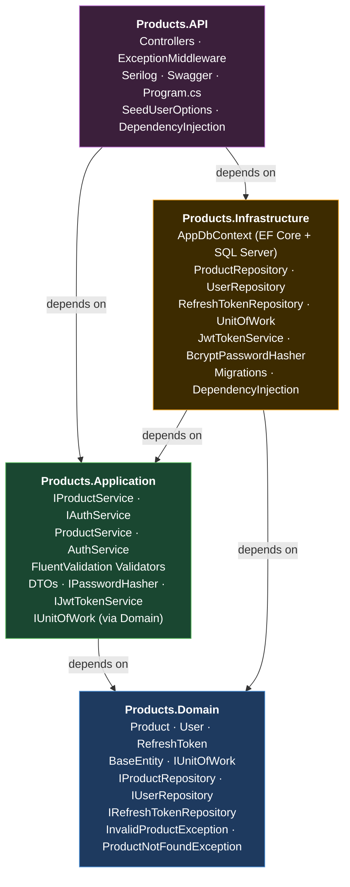
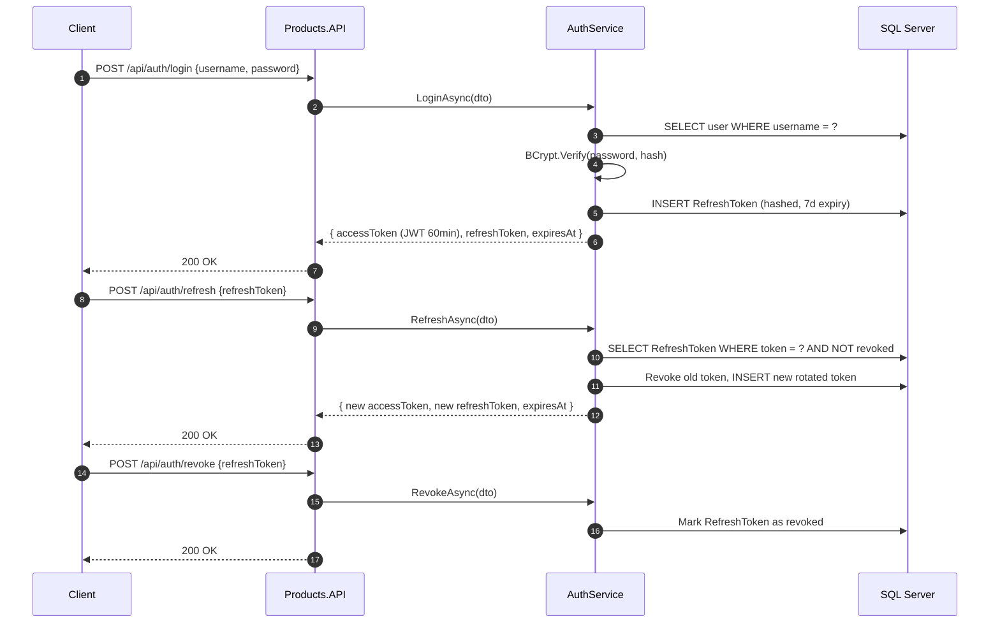
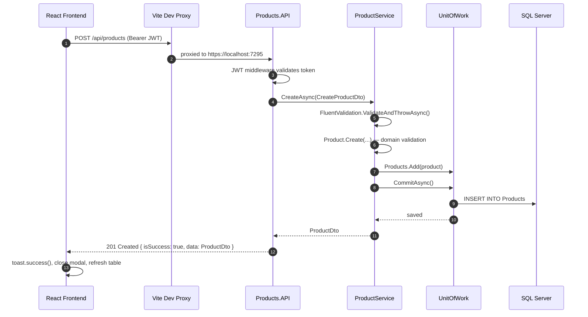

# Architecture

## Overview

A full-stack web application built with **.NET 8 Clean Architecture** on the backend and **React + TypeScript** on the frontend. The backend follows a strict layered dependency model. The frontend is a Vite-powered SPA communicating with the API over HTTPS.

---

## 1. Solution Structure

```
ProductsApi.sln
├── src/
│   ├── Products.Domain           # Core entities, interfaces, exceptions
│   ├── Products.Application      # Services, DTOs, validators, interfaces
│   ├── Products.Infrastructure   # EF Core, JWT, BCrypt, migrations
│   └── Products.API              # Controllers, middleware, DI wiring, Program.cs
├── tests/
│   ├── Products.UnitTests        # xUnit — domain + service logic
│   └── Products.IntegrationTests # xUnit — full HTTP stack via WebApplicationFactory
└── frontend/                     # React + TypeScript (Vite)
    └── src/
        ├── api/                  # Axios client, authApi, productsApi
        ├── components/           # ProductTable, ProductModal, CreateProductForm
        ├── context/              # AuthContext, ThemeContext
        ├── pages/                # LoginPage, ProductsPage
        └── types/                # Shared TypeScript interfaces
```

---

## 2. Clean Architecture Layers

Each layer depends strictly inward. The Domain has zero dependencies on any framework or external package.



**Dependency rule:**

| Layer | May reference |
|---|---|
| Domain | Nothing — pure C# |
| Application | Domain only |
| Infrastructure | Domain + Application |
| API | Application + Infrastructure |

---

## 3. Backend — Key Design Decisions

### Service Pattern (not CQRS)

Business logic lives in focused services (`ProductService`, `AuthService`) rather than MediatR command/query handlers. This keeps the layer thin and avoids unnecessary ceremony for a single-resource API. Each service method maps 1:1 to an HTTP endpoint and validates inputs using FluentValidation before touching the domain.

### Unit of Work

`IUnitOfWork` wraps `AppDbContext` and enforces a single transaction boundary per request.

- `IProductRepository.Add / Update / Remove` are **synchronous void** — they stage EF change-tracking entries but never save.
- `IUnitOfWork.CommitAsync()` calls `SaveChangesAsync()` — the only point at which SQL is committed.
- Registering `UnitOfWork` as **Scoped** ensures each HTTP request gets an isolated instance.

### Authentication — JWT + Refresh Tokens



- Access tokens are **short-lived JWTs** (60 minutes, RS256-signed).
- Refresh tokens are **opaque, hashed** before storage. Token rotation is applied on every refresh — the old token is revoked and a new one issued.
- The frontend schedules a silent refresh **60 seconds before expiry** using `setTimeout` in `AuthContext`.

### Error Handling

`ExceptionMiddleware` catches all unhandled exceptions and maps them to a consistent `ApiResponse<T>` envelope:

```json
{
  "isSuccess": false,
  "responseCode": 404,
  "responseMsg": "Product abc123 not found.",
  "data": null
}
```

Successful responses follow the same shape with `"isSuccess": true` and `"data"` populated.

---

## 4. API Endpoints

| Method | Route | Auth | Description |
|--------|-------|------|-------------|
| `POST` | `/api/auth/login` | ❌ | Authenticate and receive tokens |
| `POST` | `/api/auth/refresh` | ❌ | Exchange refresh token for new pair |
| `POST` | `/api/auth/revoke` | ❌ | Revoke a refresh token |
| `GET` | `/api/products` | ✅ JWT | List all products (optional `?colour=` filter) |
| `POST` | `/api/products` | ✅ JWT | Create a product |
| `PUT` | `/api/products/{id}` | ✅ JWT | Update a product |
| `DELETE` | `/api/products/{id}` | ✅ JWT | Delete a product |
| `GET` | `/health` | ❌ | Health check |

---

## 5. Database

**SQL Server** via Entity Framework Core 8. Two migrations applied:

| Migration | Tables |
|-----------|--------|
| `InitialCreate` | `Products` |
| `AddUsersTable` | `Users`, `RefreshTokens` |

`User.Roles` is stored as a JSON array (`["Admin"]`) using EF Core's built-in JSON column support.

Seed users are loaded from `appsettings.json → SeedUsers[]` on startup (BCrypt-hashed at seed time).

---

## 6. Testing

| Project | Type | Count | Tooling |
|---------|------|-------|---------|
| `Products.UnitTests` | Unit | 17 | xUnit, Moq, FluentAssertions |
| `Products.IntegrationTests` | Integration | 14 | xUnit, WebApplicationFactory, EF Core InMemory |

Integration tests spin up the full ASP.NET Core pipeline in-process and replace SQL Server with an in-memory EF provider.

---

## 7. Frontend Architecture

**React 19 + TypeScript + Vite**, styled with **Tailwind CSS v4**.

```
AuthContext ──► auto refresh timer (setTimeout, 60s before expiry)
              ──► revoke on logout

ThemeContext ──► dark / light mode (localStorage + OS preference)

ProductsPage
  ├── ProductTable ──► Edit (opens ProductModal pre-filled)
  │                ──► Delete (inline confirm → deleteProduct API)
  └── ProductModal ──► CreateProductForm (create or edit mode)

react-toastify ──► success / error / info notifications
```

### Token Refresh Flow (Frontend)

1. On login, `AuthContext` stores the access token in memory and `refreshToken` in a `useRef`.
2. A `setTimeout` is scheduled to fire 60 seconds before `accessTokenExpiresAt`.
3. On trigger, `POST /api/auth/refresh` is called silently — the new tokens replace the old ones.
4. If refresh fails (token expired/revoked), the user is logged out automatically.
5. On logout, `POST /api/auth/revoke` is called to invalidate the refresh token server-side.

### Dark / Light Mode

`ThemeContext` adds/removes the `dark` class on `<html>`. Tailwind's `@custom-variant dark` directive applies `dark:` utility classes throughout all components. The selected theme is persisted to `localStorage` and defaults to the OS preference (`prefers-color-scheme`).

---

## 8. Request Flow — Create Product (End-to-End)


